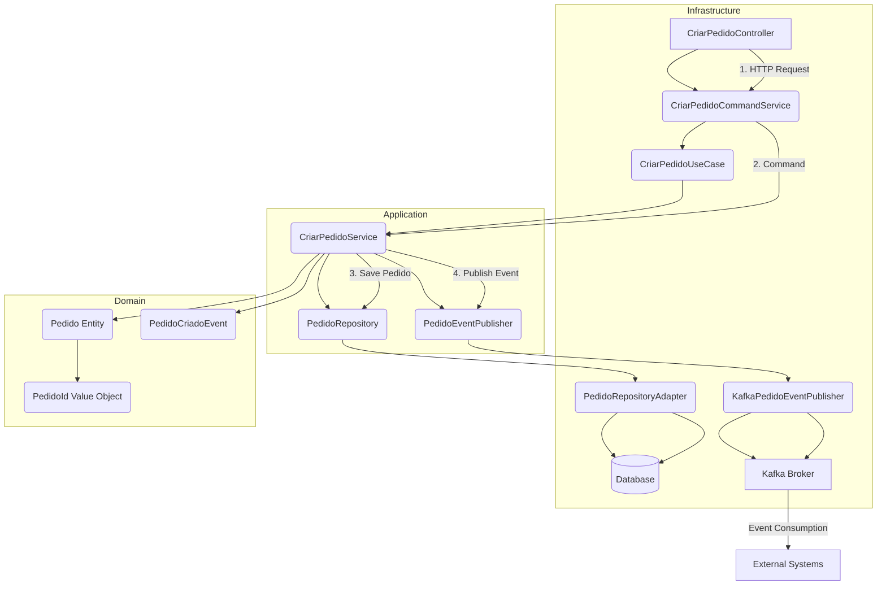

# Arch EDA App

This project implements an enterprise application in Java 21 with Spring Boot 3, following Clean Architecture and Domain-Driven Design (DDD) principles.

## Requirements Implemented:

*   Clear separation between domain, application, and infrastructure layers.
*   Rich entities (not anemic).
*   Usage of Value Objects.
*   Domain events.
*   Event publication via Kafka.
*   Externalized configuration (dev and prod profiles).
*   Multi-stage Dockerfile.
*   Healthcheck with Actuator.
*   OpenAPI (Swagger) documentation.
*   Structured logs.
*   Adherence to SOLID principles.

## Use Case: CriarPedido (Create Order)

*   Validates business rules.
*   Persists in the database.
*   Publishes `PedidoCriado` event to Kafka.
*   Returns a DTO response.

## Architectural Decisions

The project structure is organized to follow Clean Architecture and Domain-Driven Design (DDD) principles, aiming for a clear separation of concerns, testability, and maintainability.

*   **Clean Architecture Rings:** Domain, Application, and Infrastructure layers ensure clear responsibilities and dependencies flow inward.
*   **Domain-Driven Design (DDD) Elements:** Rich Entities, Value Objects, Domain Events, Domain Services, and Repositories are used to model the core business logic effectively.
*   **Ports and Adapters Pattern (Hexagonal Architecture):** Interfaces (ports) define boundaries, and implementations (adapters) handle external technology concerns, promoting loose coupling.
*   **Spring Boot Integration:** Leverages Spring Boot for rapid development, including web, data, messaging, and operational features.
*   **Quality Attributes:** Focus on testability, maintainability, scalability, and observability.

## How to Start the Application

### Prerequisites

*   Java Development Kit (JDK) 21
*   Apache Maven 3.8+
*   Docker (optional, for running with Docker)
*   Kafka (running instance, e.g., via Docker)

### 1. Build the Project

Navigate to the `arch-eda-app` directory and build the project using Maven:

```bash
cd arch-eda-app
mvn clean install
```

### 2. Run Kafka

If you don't have a Kafka instance running, you can use Docker to set one up. For example, using a `docker-compose.yml` file:

```yaml
version: '3'
services:
  zookeeper:
    image: confluentinc/cp-zookeeper:7.0.1
    hostname: zookeeper
    container_name: zookeeper
    ports:
      - "2181:2181"
    environment:
      ZOOKEEPER_CLIENT_PORT: 2181
      ZOOKEEPER_TICK_TIME: 2000

  broker:
    image: confluentinc/cp-kafka:7.0.1
    hostname: broker
    container_name: broker
    ports:
      - "9092:9092"
      - "9093:9093"
    environment:
      KAFKA_BROKER_ID: 1
      KAFKA_ZOOKEEPER_CONNECT: 'zookeeper:2181'
      KAFKA_LISTENER_SECURITY_PROTOCOL_MAP: PLAINTEXT:PLAINTEXT,PLAINTEXT_HOST:PLAINTEXT
      KAFKA_ADVERTISED_LISTENERS: PLAINTEXT://broker:29092,PLAINTEXT_HOST://localhost:9092
      KAFKA_INTER_BROKER_LISTENER_NAME: PLAINTEXT
      KAFKA_OFFSETS_TOPIC_REPLICATION_FACTOR: 1
      KAFKA_GROUP_INITIAL_REBALANCE_DELAY_MS: 0
      KAFKA_AUTO_CREATE_TOPICS_ENABLE: "true"
    depends_on:
      - zookeeper
```

Then run:

```bash
docker-compose up -d
```

### 3. Run the Application

#### Option A: Run as Spring Boot Application

From the `arch-eda-app` directory:

```bash
java -jar target/arch-eda-app-0.0.1-SNAPSHOT.jar
```

To run with a specific profile (e.g., `dev`):

```bash
java -jar -Dspring.profiles.active=dev target/arch-eda-app-0.0.1-SNAPSHOT.jar
```

#### Option B: Run with Docker

Build the Docker image:

```bash
docker build -t arch-eda-app .
```

Run the Docker container:

```bash
docker run -p 8080:8080 arch-eda-app
```

### Accessing the Application

Once running, the application will be available at `http://localhost:8080` (or `http://localhost:8081` for `dev` profile).

*   **Healthcheck:** `http://localhost:8080/actuator/health`
*   **Swagger UI (OpenAPI):** `http://localhost:8080/swagger-ui.html`

## How to Debug the Application

### 1. Debugging in an IDE (IntelliJ IDEA, VS Code, etc.)

Most modern IDEs provide excellent support for debugging Spring Boot applications.

*   **IntelliJ IDEA:**
    1.  Open the `arch-eda-app` project.
    2.  Locate the `ArchEdaAppApplication.java` file.
    3.  Click the "Run" or "Debug" icon next to the `main` method.
    4.  Set breakpoints in your code by clicking in the left margin next to the line numbers.

*   **VS Code:**
    1.  Open the `arch-eda-app` folder in VS Code.
    2.  Install the "Extension Pack for Java".
    3.  Go to the "Run and Debug" view (`Ctrl+Shift+D` or `Cmd+Shift+D`).
    4.  Click "create a launch.json file" and select "Java".
    5.  A default configuration for running your Spring Boot app should be generated.
    6.  Set breakpoints as needed and start debugging.

### 2. Remote Debugging (for Docker Containers or External Environments)

To debug a Spring Boot application running in a Docker container or a remote server, you need to enable remote debugging.

*   **Modify `ENTRYPOINT` in Dockerfile:**
    Change the `ENTRYPOINT` in your `Dockerfile` to include Java debug options. For example:

    ```dockerfile
    ENTRYPOINT ["java", "-agentlib:jdwp=transport=dt_socket,server=y,suspend=n,address=*:5005", "-jar", "app.jar"]
    ```

    *   `address=*:5005`: This exposes the debugger on port 5005. Make sure this port is exposed in your `docker run` command (`-p 5005:5005`).
    *   `suspend=n`: The application will start immediately and wait for the debugger to connect. If you set `suspend=y`, the application will wait until a debugger connects before executing any code.

*   **Rebuild and Run Docker Image:**
    After modifying the `Dockerfile`, rebuild and run your Docker image, ensuring to expose port 5005:

    ```bash
    docker build -t arch-eda-app-debug .
    docker run -p 8080:8080 -p 5005:5005 arch-eda-app-debug
    ```

*   **Configure Remote Debugger in IDE:**
    In your IDE, create a "Remote JVM Debug" (or similar) configuration:
    *   **Host:** `localhost` (if running Docker locally) or the IP address of your remote server.
    *   **Port:** `5005`

    Connect your IDE's debugger to this remote configuration to start debugging.

### 3. Checking Logs

For both local and Docker runs, check the application logs for any errors or unexpected behavior.

*   **Local:** Logs are printed to the console.
*   **Docker:** Use `docker logs <container_id_or_name>` to view container logs.

### 4. Actuator Endpoints

Utilize Spring Boot Actuator for monitoring and inspecting the application's state:

*   `/actuator/health`: Check application health.
*   `/actuator/info`: Get application info.
*   `/actuator/metrics`: View various metrics.
*   `/actuator/httptrace`: See recent HTTP requests.
*   `/actuator/env`: View environment properties.
*   `/actuator/loggers`: Configure logging levels at runtime.

By following these steps, you should be able to effectively start, monitor, and debug the `Arch EDA App`.

## Architectural Diagram


